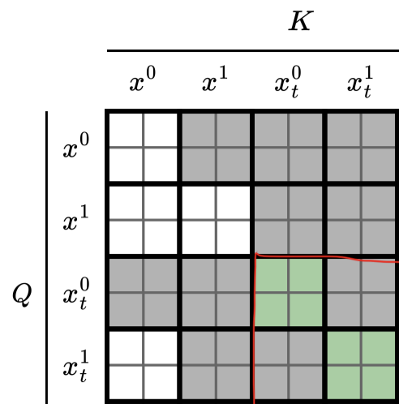

trainer.py initializes trainers in trainer/ which can be diffusion/distillation/gan/ode. These trainers respectively call the models in model/ which has the generator_loss() function. Inside they call the actual model wrapped in utils/wan_wrapper.py which is wan/modules/causal_model.py

the provided ckpts are either after ode or after dmd/distilation. It's unclear how they produced the dmd ckpt. Potentially a combination of experimental trainings with different losses are used. Currently you can only train with one loss at a time

## Losses
### Diffusion/Teacher Forcing with Clean
This is the teacher forcing loss but with the efficient masking introduced in kaiming's AR diffusion image gen paper, so that you can train all chunks in parallel.

generator_loss
- clean_latent: [B,F,C,H,W] taken from the last step index of ode_latens: [B,N_steps,F,C,H,W] which is [B,4,21,16,60,104]
- image_or_video_shape: [B,F,C,H,W]
- noisy_latents is created by adding sampled noise - with independent noise levels to clean_latens
- training_target: velocity (for flow matching loss)

flow_pred, x0_pred = self.generator(
    noisy_image_or_video=noisy_latents,
    conditional_dict=conditional_dict,
    timestep=timestep,
    clean_x=clean_latent if self.teacher_forcing else None,
    aug_t=timesteps if self.teacher_forcing else None
)

flow_pred = self.model(
    noisy_image_or_video.permute(0, 2, 1, 3, 4),
    t=input_timestep, context=prompt_embeds,
    seq_len=self.seq_len=32760,
    clean_x=clean_x.permute(0, 2, 1, 3, 4),
    aug_t=aug_t,
).permute(0, 2, 1, 3, 4)

x: [B, C, F, H, W]
t: [B]
context: [B,L,C]
seq_len: 32760
y: None

x = [self.patch_embedding(u.unsqueeze(0)) for u in x]: noisy latents for model input
clean_x = [self.patch_embedding(u.unsqueeze(0)) for u in clean_x]
clean_x = torch.cat([
    torch.cat([u, u.new_zeros(1, seq_lens_clean[0] - u.size(1), u.size(2))], dim=1) for u in clean_x
])
x = torch.cat([clean_x, x], dim=1)
e0 = torch.cat([e0_clean, e0], dim=1) # this is timesteps, e0_clean is all 0

### ODE (Diffusion Forcing/Teacher Forcing with noise)
```py
noisy_input, timestep = self._prepare_generator_input(
            ode_latent=ode_latent)
noisy_input: [B,F,C,H,W]

_, pred_image_or_video = self.generator(
    noisy_image_or_video=noisy_input,
    conditional_dict=conditional_dict,
    timestep=timestep
)
mask = timestep != 0

loss = F.mse_loss(
    pred_image_or_video[mask], target_latent[mask], reduction="mean")
```

### DMD
ditillation.py
```py
def __init__():
    dataset = TextDataset(config.data_path)
    -> __getitem__(idx)
        batch = {
                "prompts": self.prompt_list[idx],
                "idx": idx,
        }
def train():

    TRAIN_GENERATOR = self.step % self.config.dfake_gen_update_ratio == 0
    if TRAIN_GENERATOR:
        batch = next(self.dataloader)
        extra = self.fwdbwd_one_step(batch)


def fwdbwd_one_step(batch):
    self.model.eval()
    text_prompts = batch["prompts"]
    clean_latent = None
    image_latent = None
    batch_size = len(text_prompts)
    image_or_video_shape = [B, C, F, H, W]
    with torch.no_grad():
        conditional_dict = self.model.text_encoder(
                text_prompts=text_prompts)
    
    generator_loss, generator_log_dict = self.model.generator_loss(
        image_or_video_shape=image_or_video_shape,
        conditional_dict=conditional_dict,
        unconditional_dict=unconditional_dict,
        clean_latent=None,
        initial_latent=None
    )

    critic_loss, critic_log_dict = self.model.critic_loss(
        image_or_video_shape=image_or_video_shape,
        conditional_dict=conditional_dict,
        unconditional_dict=unconditional_dict,
        clean_latent=None,
        initial_latent=None
    )
```

dmd.py
```py
def generator_loss():
    pred_image, gradient_mask, denoised_timestep_from, denoised_timestep_to = self._run_generator(
        image_or_video_shape=image_or_video_shape,
        conditional_dict=conditional_dict,
        initial_latent=None
    )

```

model/base.py->SelfForcingModel(BaseModel)
```py
def _run_generator():
    noise_shape = image_or_video_shape.copy()
    min_num_frames = 21
    max_num_frames = 21
    max_num_blocks = 21
    min_num_blocks = 21
    num_generated_blocks = torch.randint(min_num_blocks, max_num_blocks + 1, (1,))=[21]

    pred_image_or_video, denoised_timestep_from, denoised_timestep_to = self._consistency_backward_simulation(
        noise=torch.randn(noise_shape,
                            device=self.device, dtype=self.dtype),
        **conditional_dict,
    )

def _consistency_backward_simulation():
    return self.inference_pipeline.inference_with_trajectory(
        noise=noise, **conditional_dict
    ) # SelfForcingTrainingPipeline below
```

pipeline/self_forcing_training.py->SelfForcingTrainingPipeline
```py
def __init__():
    self.denoising_step_list = [1000,750,500]
    self.frame_seq_length = 1560
    self.kv_cache1 = None
    self.kv_cache2 = None
    self.same_step_across_blocks = True
    self.last_step_only = False
    self.kv_cache_size = num_max_frames * self.frame_seq_length

def inference_with_trajectory():
    batch_size, num_frames, num_channels, height, width = noise.shape = [1,21,C,H,W]
    num_blocks = (num_frames - 1) // self.num_frame_per_block = 7
    num_input_frames = 0
    num_output_frames = num_frames + num_input_frames = 21
    output = torch.zeros([batch_size, num_output_frames, num_channels, height, width])
    self._initialize_kv_cache(
        batch_size=batch_size, dtype=noise.dtype, device=noise.device
    ) # hardcoded dimensions
    """
    {
        "k": torch.zeros([batch_size, self.kv_cache_size, 12, 128]),
        "v": torch.zeros([batch_size, self.kv_cache_size, 12, 128]),
        "global_end_index": torch.tensor([0]),
        "local_end_index": torch.tensor([0])
    }
    """
    self._initialize_crossattn_cache(
        batch_size=batch_size, dtype=noise.dtype, device=noise.device
    )
    """
    {
        "k": torch.zeros([batch_size, 512, 12, 128]),
        "v": torch.zeros([batch_size, 512, 12, 128]),
        "is_init": False
    }
    """
    current_start_frame = 0
    all_num_frames = [self.num_frame_per_block = 3] * num_blocks = [3,3,3,3,3,3,3]
    num_denoising_steps = 3
    exit_flags = self.generate_and_sync_list(len(all_num_frames), num_denoising_steps, device=noise.device) # same noising across gpus
    for block_index, current_num_frames in enumerate(all_num_frames): # [3,3,3,3,3,3,3]
        noisy_input = noise[
                :, current_start_frame:current_start_frame + current_num_frames] # one block to denoise
        for index, current_timestep in enumerate(self.denoising_step_list):
            timestep = [current_timestep] * current_num_frames = [current_timestep] * 3
            exit_flag = (index == exit_flags[0])
            if not exit_flag:
                with torch.no_grad():
                    _, denoised_pred = self.generator()
                    # noisy_input = consistency sample
            else:
                _, denoised_pred = self.generator(
                    noisy_image_or_video=noisy_input,
                    conditional_dict=conditional_dict,
                    timestep=timestep,
                    kv_cache=self.kv_cache1,
                    crossattn_cache=self.crossattn_cache,
                    current_start=current_start_frame * self.frame_seq_length = 0/1560/3120...
                )
        
        # generated one new complete block
        output[:, current_start_frame:current_start_frame + current_num_frames] = denoised_pred
        # Step 3.3: rerun with timestep zero to update the cache
```

utils/wan_wrapper.py
```py
def forward():
    flow_pred = self.model(
        noisy_image_or_video.permute(0, 2, 1, 3, 4),
        t=input_timestep, context=prompt_embeds,
        seq_len=self.seq_len=32760,
        kv_cache=kv_cache,
        crossattn_cache=crossattn_cache,
        current_start=current_start,
    ).permute(0, 2, 1, 3, 4)
```

wan/modules/causal_model.py
```py
def _forward_train(
        self,
        x=noisy_input=[B,3,C,H,W],
        t,
        context=prompt_embeds,
        seq_len=32760,
    ):
    x = [self.patch_embedding(u.unsqueeze(0)) for u in x] # [3,dim,H/2,W/2]*B
    grid_sizes = torch.stack(
        [torch.tensor(u.shape[2:], dtype=torch.long) for u in x]) # [3, H/2, W/2]*B
    x = [u.flatten(2).transpose(1, 2) for u in x] # [3*H*W/4, dim]*B
    seq_lens = torch.tensor([u.size(1) for u in x], dtype=torch.long) = [1560*3]*B
    e = self.time_embedding(t) # [B,dim]
    e0 = self.time_projection(e).unflatten(
            1, (6, self.dim)).unflatten(dim=0, sizes=t.shape) 
    kwargs = dict(
        e=e0,
        seq_lens=seq_lens,
        grid_sizes=grid_sizes,
        freqs=self.freqs,
        context=context,
        context_lens=None,
        block_mask=self.block_mask)
     x = block(x, **kwargs)

class CausalWanAttentionBlock:
    def forward(
        self,
        x,
        e,
        seq_lens,
        grid_sizes,
        freqs,
        context,
        context_lens,
        block_mask,
        kv_cache=None,
        crossattn_cache=None,
        current_start=0,
        cache_start=None
    ):
        num_frames, frame_seqlen = e.shape[1], x.shape[1] // e.shape[1] = 3, 1560
        x = self.norm1(x)
        x = x.unflatten(dim=1, sizes=(num_frames, frame_seqlen)) # [B,3,1560,dim]
        x = x * (1 + e[1]) + e[0] # modulation
        x = x.flatten(1, 2) # [B,3*1560,dim]

        # self-attention
        y = self.self_attn(
            (x),
            seq_lens, grid_sizes,
            freqs, block_mask, kv_cache, current_start=0, cache_start=None)


class CausalWanSelfAttention:
    cache_start = current_start = 0
    q, k, v = qkv_fn(x)
    frame_seqlen = math.prod(grid_sizes[0][1:]).item() = H*W/2^2 = 1560
    current_start_frame = 0
    sink_tokens = 0 * frame_seqlen
    current_end = num_new_tokens = 3
    local_end_index = kv_cache["local_end_index"].item() + current_end - kv_cache["global_end_index"].item() = 0 + 3 - 0 = 3
    local_start_index = local_end_index - num_new_tokens = 0
    kv_cache["k"][:, local_start_index:local_end_index] = roped_key
    kv_cache["v"][:, local_start_index:local_end_index] = v
    x = attention(
        roped_query,
        kv_cache["k"][:, max(0, local_end_index - self.max_attention_size):local_end_index],
        kv_cache["v"][:, max(0, local_end_index - self.max_attention_size):local_end_index]
    )
    kv_cache["global_end_index"].fill_(current_end)
    kv_cache["local_end_index"].fill_(local_end_index)
    x = x.flatten(2)
    x = self.o(x)

```


## Masking
### Teacher Forcing
wan/modules/causal_model.py

```py
self.block_mask = self._prepare_teacher_forcing_mask(
    device, num_frames=x.shape[2],
    frame_seqlen=x.shape[-2] * x.shape[-1] // (self.patch_size[1] * self.patch_size[2]),
    num_frame_per_block=self.num_frame_per_block
)

# Actual numbers
patch_size=(1, 2, 2)
self.block_mask = self._prepare_teacher_forcing_mask(num_frames=21, frame_seqlen=60 * 104 // (2 * 2)=1560, num_frame_per_block=1)

```


_prepare_teacher_forcing_mask
```py
total_length = num_frames * frame_seqlen * 2
clean_ends = total_length / 2
context_ends = 
noise_context_starts = 
noise_context_ends = 
noise_noise_starts = 
noise_noise_ends = torch.zeros(total_length)

attention_block_size = frame_seqlen * num_frame_per_block = frame_seqlen
frame_indices = torch.arange(start=0, end=clean_ends, step=attention_block_size=frame_seqlen) 
            = [0,1560,3120,...,1560*20]
for start in frame_indices:
    context_ends[start:start + attention_block_size] = start + attention_block_size
# context_ends = [1560,1560,....,3240,3240,...]
noisy_image_start_list = torch.arange(
    clean_ends, clean_ends*2,
    step=attention_block_size) = [1560*20,1560*21,...,1560*41]
noisy_image_end_list = noisy_image_start_list + attention_block_size = [1560*21,1560*22,...,1560*42]

noise_noise_starts = [1560*20,1560*20,...,1560*21,1560*21,...]
noise_noise_ends = 

noise_context_ends = [0,0,...,1560,1560,...]


def attention_mask(b, h, q_idx, kv_idx):
    # first design the mask for clean frames
    clean_mask = (q_idx < clean_ends) & (kv_idx < context_ends[q_idx])
    # then design the mask for noisy frames
    # noisy frames will attend to all clean preceeding clean frames + itself
    C1 = (kv_idx < noise_noise_ends[q_idx]) & (kv_idx >= noise_noise_starts[q_idx])
    C2 = (kv_idx < noise_context_ends[q_idx]) & (kv_idx >= noise_context_starts[q_idx])
    noise_mask = (q_idx >= clean_ends) & (C1 | C2)

    eye_mask = q_idx == kv_idx
    return eye_mask | clean_mask | noise_mask

block_mask = create_block_mask(attention_mask, B=None, H=None, Q_LEN=total_length + padded_length,KV_LEN=total_length + padded_length)

```
This is the height and width of the mask


### ODE/Distillation/GAN
self.block_mask = self._prepare_blockwise_causal_attn_mask